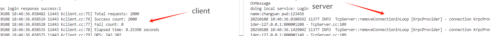

# Krpc

> ⭐️ 本项目为[【代码随想录知识星球】](https://programmercarl.com/other/kstar.html) 教学项目   
> ⭐️ 在 [手写RPC框架文档](https://www.programmercarl.com/other/project_C++RPC.html)  里详细讲解：**项目前置知识 + 项目细节 +  代码解读 + 项目难点 + 面试题与回答 + 简历写法  + 项目拓展**。 全面帮助你用这个项目求职面试！

# 项目概述

本项目基于protobuf的c++分布式网络通信框架，使用了zookeeper作为服务中间件，负责解决在分布式服务部署中 服务的发布与调用、消息的序列与反序列化、网络包的收发等问题，使其能提供高并发的远程函数调用服务，可以让使用者专注于业务，快速实现微服务的分布式部署，项目会继续完善的欢迎，大家一起学习。

## 运行环境

Ubuntu 22.04 LTS

## 编译指令

进入到Krpc文件
```shell
cd Krpc
```

生成项目可执行程序
```shell
mkdir build && cd build && cmake .. && make -j${4} 
```


进入到bin目录下，分别运行server和client文件下的./server和./client，即可完成服务发布和调用。

server:
```shell
./server -i ../test.conf
```

client:
```shell
./client -i ../test.conf
```

**注意**： 需要重新编译只需要在build目录下执行MAKE -J${4} 即可。
## 库准备

1. Muduo 库的安装
Muduo 是一个基于多线程 Epoll 模式的高效网络库，负责数据流的网络通信。
安装教程参考：[Mudo安装](https://blog.csdn.net/QIANGWEIYUAN/article/details/89023980)

2. Zookeeper 的安装
Zookeeper 负责服务注册与发现，动态记录服务的 IP 地址及端口号，以便调用端快速找到目标服务。
安装步骤：
安装 Zookeeper：
```shell
sudo apt install zookeeperd
```
安装 Zookeeper 开发库：
```shell
sudo apt install libzookeeper-mt-dev
```

3. Protobuf 的安装
Protobuf 负责 RPC 方法的注册、数据的序列化与反序列化。
相较于 XML 和 JSON，Protobuf 是二进制存储，效率更高。
本地版本：3.12.4
在 Ubuntu 22 上可以直接安装：
```shell
sudo apt-get install protobuf-compiler libprotobuf-dev
```

4. Glog 日志库的安装
Glog 是一个高效的异步日志库，用于记录框架运行时的调试与错误日志。
```shell
sudo apt-get install libgoogle-glog-dev libgflags-dev
```

## 整体的框架

- **muduo库**：负责数据流的网络通信，采用了多线程epoll模式的IO多路复用，让服务发布端接受服务调用端的连接请求，并由绑定的回调函数处理调用端的函数调用请求。

- **Protobuf**：负责RPC方法的注册，数据的序列化和反序列化，相比于文本存储的XML和JSON来说，Protobuf是二进制存储，且不需要存储额外的信息，效率更高。

- **Zookeeper**：负责分布式环境的服务注册，记录服务所在的IP地址以及端口号，可动态地为调用端提供目标服务所在发布端的IP地址与端口号，方便服务所在IP地址变动的及时更新。

- **TCP沾包问题处理**：定义服务发布端和调用端之间的消息传输格式，记录方法名和参数长度，防止沾包。

- **Glog日志库**：后续增加了Glog的日志库，进行异步的日志记录。

## 性能测试

通过运行bin目录下的server和client就可以看见结果，测试了性能，但是并不是高效的。

## 运行结果

## 总结
- Krpc是一个基于protobuf的C++分布式网络通信框架，旨在简化微服务的部署与调用。
- 通过结合Muduo库、Zookeeper和Glog，Krpc提供了高效的网络通信、服务注册与发现以及日志记录功能。
- 该框架支持高并发的远程函数调用，允许开发者专注于业务逻辑的实现。
- 项目的设计考虑了性能和易用性，适合在现代分布式系统中使用。
- 未来将继续完善，欢迎更多开发者参与学习与贡献。

